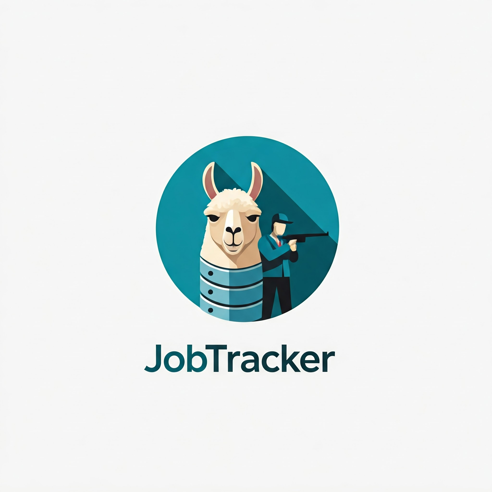

# JobTracker 💼🦙

Streamline your job search and application process with **JobTracker**, a command-line tool that helps you organize and manage your job applications using a local database. Tired of messy spreadsheets? **JobTracker** provides a structured and efficient way to track your job search progress.

## Key Features

*   **Effortless Job Logging:** Quickly add job postings to your local database directly from your clipboard.
*   **Intelligent Parsing (Powered by LLMs):** JobTracker uses large language models (LLMs) to automatically extract key information from job descriptions, saving you time and effort.
*   **Structured Data Storage:** Store essential job details, including company name, position title, application date, job link, application status, and more, in a well-organized database.
*   **CLI Interface:** Simple and intuitive command-line interface for easy interaction.
*   **Project Alignment and Skill Gap Analysis:** (Future Feature) Plan to add functionality to compare your skills and experience with job requirements.

## Getting Started

### Prerequisites

*   Python 3.11+
*   Poetry (recommended package manager)
*   PostgreSQL (local or remote database)
*   Ollama (for LLM functionality)
*   Docker (for hosting your own database)

### Installation

1.  Clone the repository:

    ```bash
    git clone [https://github.com/](https://github.com/)[your_username]/JobTracker.git
    cd JobTracker
    ```

2.  Install dependencies using [Poetry](https://python-poetry.org/docs/#installation):

    ```bash
    poetry install
    ```

3.  Set up your PostgreSQL database and create a `.env` file in the project root with the following variables:

    ```
    POSTGRES_USER=your_username
    POSTGRES_PASSWORD=your_password
    POSTGRES_DB=your_database_name
    DB_HOST=localhost
    DB_PORT=5432
    DATABASE_URL="postgresql://${POSTGRES_USER}:${POSTGRES_PASSWORD}@${DB_HOST}:${DB_PORT}/${POSTGRES_DB}"
    ```

4. Ensure Ollama is running and accessible.

5. Ensure you have Docker installed and running.

### Usage

To add a new job entry:

1.  Turn on your database with Docker Compose:
    ```bash
    docker compose up -d --build
    ```
    This command will build and start the database container in detached mode.

2.  Copy the job description to your clipboard.

3.  Run the JobTracker script:

    ```bash
    poetry run python job_tracker/main.py --schema init.sql
    ```
    or if you installed `poetry shell` you can use it to run as: 
    ```bash
    python job_tracker/main.py --schema init.sql
    ```

4.  Follow the interactive prompts to confirm the extracted information and add the job to your database.

## Database Schema

You can incoprate your own schemas, but you will need to edit the `template` for the langchain, so that it can properly create the desired json output you want.

## License

This project is licensed under the terms of the [MIT License](LICENSE).

## Example

To get started, navigate to the job posting on the website and copy the application details. 
Once you run the script, it will automatically generate this information as a new entry. 
You can then review and verify the details before adding them to the database.

https://github.com/user-attachments/assets/9fc67fd6-3a01-4f42-b34d-70df5c00649f


